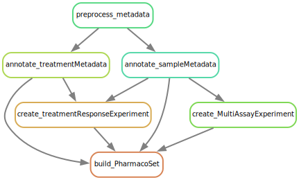
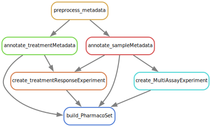
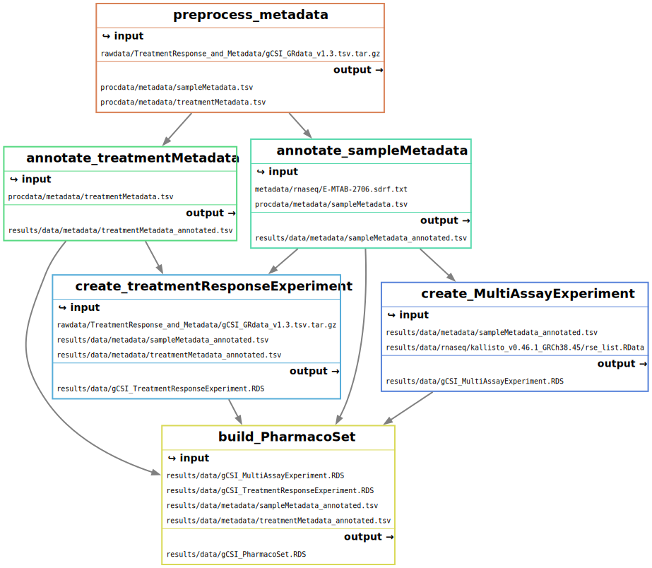

#OWNER: Jermiah Joseph
#DATE: 2024-02-20
#DESC: A pipeline to process the gCSI dataset from Genentech. At the moment it only does rnaseq data processing.

# Note: 

RNA-seq processing was done on HPC4Health cluster and uploaded to the cloud.

# GR-based drug response dataset from Genentech

[Link to Data Page](http://research-pub.gene.com/gCSI_GRvalues2019/)

- Drugs and Cell Lines per drug
  - http://research-pub.gene.com/gCSI_GRvalues2019/Cell_lines_per_drug.txt
- http://research-pub.gene.com/gCSI_GRvalues2019/gCSI_GRdata_v1.3.rds.tar.gz
- http://research-pub.gene.com/gCSI_GRvalues2019/gCSI_GRdata_v1.3.tsv.tar.gz

Download old pset

``` R
PharmacoGx::downloadPSet(name = "gCSI_2019", saveDir = ".", verbose = TRUE, timeout=3600) 
```

## So far, the following has been implemented

### Rulegraph

``` bash
snakemake --rulegraph | dot -Tsvg > resources/rulegraph.svg
```



### Directed Acyclic Graph (DAG)

```  bash
snakemake -F --dag | dot -Tsvg > resources/dag.svg
```



### Filegraph

``` bash
snakemake --filegraph | dot -Tsvg > resources/filegraph.svg
```

